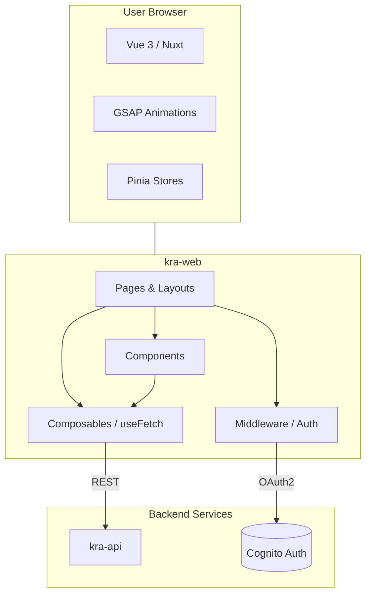

# kra-web

Frontend for the **KRA** portfolio: a highly interactive and animated interface built with **Nuxt 4** (running on Nuxt 3 compatibility). It displays projects (fetched from GitHub via the API), blog posts, and a contact form. Includes a secured **admin area** for content management.

**Stack:** Nuxt **4**, Vue **3**, **Tailwind CSS**, **Pinia** for state management, **GSAP** for premium animations, **VeeValidate** + **Zod** for form validation, **Vitest** for unit testing.

---

## Prerequisites

- **Node.js 20+** and **Yarn**
- **Environment variables** — see [Configuration](#configuration). A **`.env`** file at the root is required for local development.

---

## Quick Start

1. Copy `.env.example` to `.env` and set the required variables (API base URL, Cognito details).
2. Install dependencies: `yarn install`
3. Run the development server: `yarn dev`
4. Access the app at `http://localhost:3000`

---

## Commands

| Action | Command |
|--------|---------|
| Install dependencies | `yarn install` |
| Run dev server (port **3000**) | `yarn dev` |
| Build for production | `yarn build` |
| Generate static site (SSG) | `yarn generate` |
| Preview production build | `yarn preview` |
| Type checking | `yarn typecheck` |
| Unit tests (Vitest) | `yarn test` |
| Unit tests (Watch mode) | `yarn test:watch` |

---

## Pages

Base URL: `http://localhost:3000`

| Path | Description | Access |
|------|-------------|--------|
| `/` | **Home**: Landing page with featured content and animations | Public |
| `/projects` | **Projects**: List of portfolio projects | Public |
| `/projects/{owner}/{repo}` | **Project Detail**: Extensive info fetched from GitHub | Public |
| `/blog` | **Blog**: Article listing from DynamoDB | Public |
| `/blog/{slug}` | **Post Detail**: Full blog post content | Public |
| `/contact` | **Contact**: Lead generation form | Public |
| `/cv` | **CV**: Professional curriculum vitae | Public |
| `/admin/login` | **Login**: Admin authentication via Cognito | Public |
| `/admin` | **Dashboard**: Secured content management | Auth |

---

## Architecture



> Full system architecture (C4 Level 1, 2 & 3): [kra-docs-architecture](https://github.com/krealalejo/kra-docs-architecture)

**Structure:** Composables handle API logic, Middleware manages route protection for `/admin`, and Pinia stores global state. Animations are orchestrated with GSAP for a premium experience.

### Source layout

```
kra-web-frontend-nuxt/
├── .env.example
├── README.md
├── nuxt.config.ts
├── package.json
└── app/
    ├── app.vue               # Main entry point
    ├── components/           # Reusable UI components
    ├── composables/          # Shared logic & API calls
    ├── layouts/              # Page layouts (default, admin)
    ├── middleware/           # Auth & navigation guards
    ├── pages/                # File-based routing
    ├── stores/               # Pinia state management
    ├── types/                # TypeScript definitions
    └── server/
        └── api/              # Nuxt server routes
```

---

## Configuration

Variables used in deployment and local `.env` (see `.env.example`):

| Variable | Purpose |
|----------|---------|
| `NUXT_PUBLIC_API_BASE_URL` | Base URL for the **kra-api** backend |
| `NUXT_COGNITO_CLIENT_ID` | AWS Cognito App Client ID |
| `NUXT_COGNITO_CLIENT_SECRET` | AWS Cognito App Client Secret |
| `NUXT_PUBLIC_COGNITO_DOMAIN` | Cognito Hosted UI domain |
| `NUXT_COGNITO_REDIRECT_URI` | Redirection URI after login (**.../api/auth/callback**) |
| `NUXT_COGNITO_LOGOUT_URI` | Redirection URI after logout |

> **Note:** The app uses `ssr: false` for all routes under `/admin` to ensure compatibility with client-side auth flows through Cognito.

---

## Deployment

Managed by **Terraform** (`kra-infra`) and deployed via **GitHub Actions**. On every push to `main`, the CI/CD pipeline builds a Docker image, pushes it to ECR, and SSH-deploys it to the EC2 instance running Docker Compose alongside `kra-api`.

> Run `kra-start` to start the EC2 instance before triggering a deploy pipeline run.
